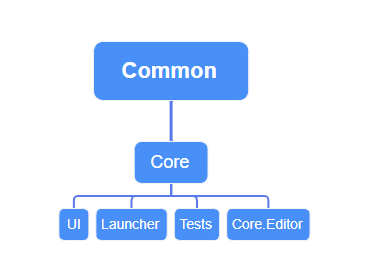

# 程序集关系图
https://www.processon.com/mindmap/688336865176736ee4cc2673

## Rain.Core.Base
职能：提供框架的基础设施和核心抽象  
特点：
- 不依赖于 Rain.Common 或其他业务模块  
- 包含接口定义、抽象类、基础工具类  
- 定义核心数据结构和通用工具函数  
- 提供框架级事件系统的抽象定义  
- 包含最小化的第三方依赖  

## Rain.Core.Module
职能：实现 Base 中定义的抽象，提供具体功能模块  
特点：
- 依赖 Rain.Core.Base
- 可以依赖 Rain.Common 和其他必要模块
- 包含具体的管理器实现（如资源管理、网络通信等）
- 实现与第三方库的集成（如 DOTween、网络库等）
- 提供可直接使用的功能模块和服务